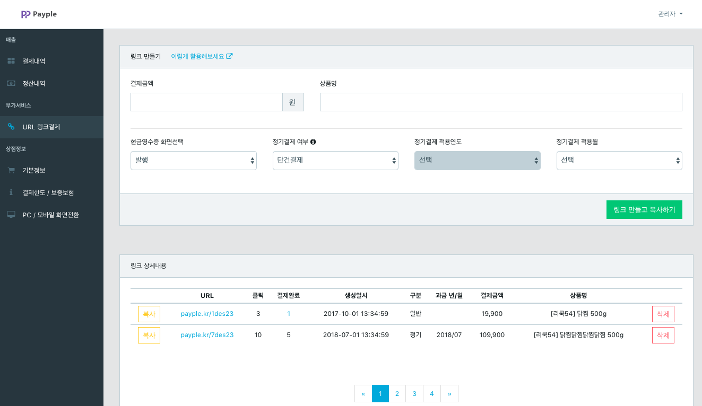
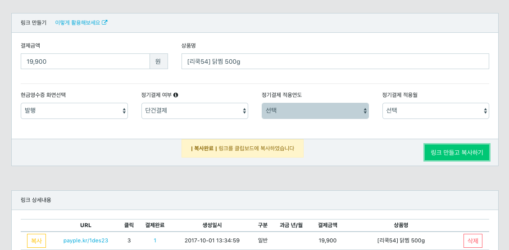
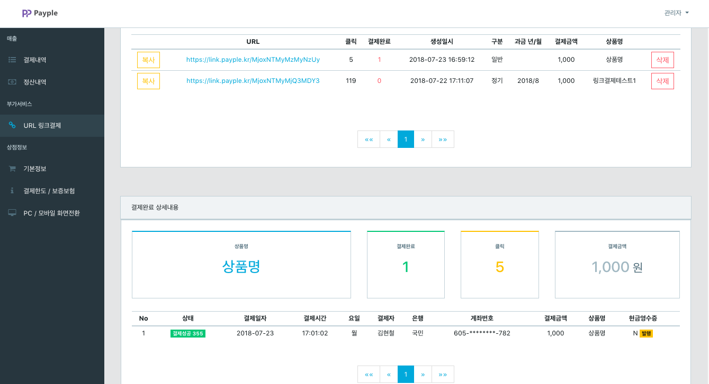

## URL 링크결제 이용 및 활용방법 
Payple 링크결제를 다양하게 활용해보세요.<br>
링크결제는 **별도의 개발이 필요없습니다.** <br>
Payple 관라지화면에서 가입즉시 이용 가능합니다.<br> 

## 화면 구성 

>링크결제 관리자화면

## 링크 만들기 
간단합니다. **결제금액, 상품명, 현금영수증 발행여부, 정기결제 여부**만 선택하면 링크가 생성됩니다.<br>
링크를 만들면 자동으로 클립보드에 복사되며, 하단 리스트에서 생성한 링크를 확인할 수 있습니다. <br><br> 

>링크 생성 후 클립보드 자동복사와 리스트 추가 

## 결제완료 상세내역 조회 
링크의 클릭과 결제완료 카운팅이 가능합니다.    
결제완료 카운팅 숫자를 통해 상세 결제내역 조회가 가능합니다. <br><br>

>결제완료 상세내역 조회 

## 링크 클릭시 보이는 화면 

## 링크결제 이렇게 활용해보세요 
#### 1. 쇼핑몰의 상품별로 링크 생성 후 결제하기 버튼 삽입 
아래 소스를 복사 후 쇼핑몰 상품 상세페이지에 붙여서 결제하기 버튼으로 만들어보세요. <br>
편하게 페이플 계좌결제를 결제수단으로 추가가 가능합니다. 
```html
<a href="#생성한 링크 URL 을 넣어주세요" target="blank"><button>계좌로 빠르게 결제하기</button></a>
```

#### 1. SNS, 블로그 등 다양한 판매채널에 링크 추가
#### 2. 학원비, 관리비 등 미납금 결제를 요청하는 문자메세지, 카카오톡에 링크 추가 
#### 3. 전화상담 후 결제가 필요한 고객에게 발송하는 문자메세지, 카카오톡에 링크 추가 
