## 가맹점 관리자화면  
가맹점에서 이용가능한 관리자화면에 대한 설명입니다.  

## 로그인 
가맹점 가입완료 후 발급되는 아이디와 비밀번호로 로그인 가능합니다.  
비밀번호 5회 미일치 시 로그인이 불가능하며, 당사로 별도 연락을 주셔야 합니다.  

## 결제내역  
가맹점의 결제내역 조회 화면입니다.  
이번달 결제내역을 기본으로 조회 가능하며, 이번달 잔여한도도 조회 가능합니다.  
또한, 결제 상세내역과 함께 현금영수증 미발행건에 대해 추가발행하는 기능도 포함되어 있습니다.  

## 정산내역  
가맹점의 정산내역 조회 화면입니다.  
결제내역과 동일하게 이번달 정산내역을 기본으로 조회 가능합니다.  

## 상점 기본정보   
가맹점의 기본 사업자정보 조회 화면입니다.  
해당화면에서 비밀번호 변경이 가능합니다.  

## 설정 - 서브관리자 등록 
설정 메뉴를 통해 서브관리자를 등록할 수 있습니다.  

## 설정 - 슬랙으로 결제 리포트 알림 받기 
팀에서 슬랙을 이용하신다면 매일 오전 9시에 어제의 결제 리포트를 받아보실 수 있습니다.  
리포트 외 URL 링크결제 완료 시 결제내역도 실시간으로 받아보실 수 있습니다.  
설정을 위해서는 슬랙 Workspace, Channel, Username, Token 입력이 필요합니다. 
* Workspace : 팀에서 이용 중인 슬랙 Workspace를 입력해주세요. (예: payple.slack.com 에서 payple 이 Workspace 입니다.) 
* Channel : 알림을 받을 채널을 입력해주세요. (예: # 뒤의 채널명을 입력해주세요. general, random 등) 
* Username : 알림을 보내는 사용자명을 입력해주세요. Full name, Display name 모두 가능합니다. 
* Token은 Legacy Tokens과 OAuth Access Tokens 모두 등록 및 사용 가능합니다.
  (Bot User OAuth Access Token 은 사용하지 않습니다.)

-Legacy Tokens은 신규발급이 중단되어 기존 Legacy Tokens을 사용했던 사용자만 이용할 수 있습니다. 
-OAuth Tokens은 신규 이용자가 이용할 수 있습니다.

## Legacy Tokens 생성 및 등록방법
[Slack Legacy Tokens](https://api.slack.com/custom-integrations/legacy-tokens)에서 생성이 가능합니다.

>Legacy Tokens 생성 버튼이 보이지 않는다면, 아래의OAuth Tokens을 등록해서 시도해주세요.  

## OAuth Tokens 생성 및 등록방법
### APP 생성하기
[Create APP](https://api.slack.com/apps) 버튼을 눌러 APP을 생성합니다.  
<kbd>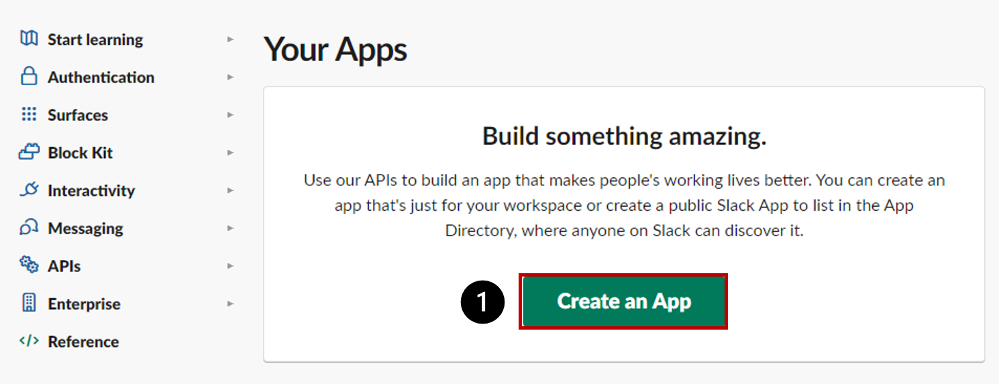</kbd>  
<kbd>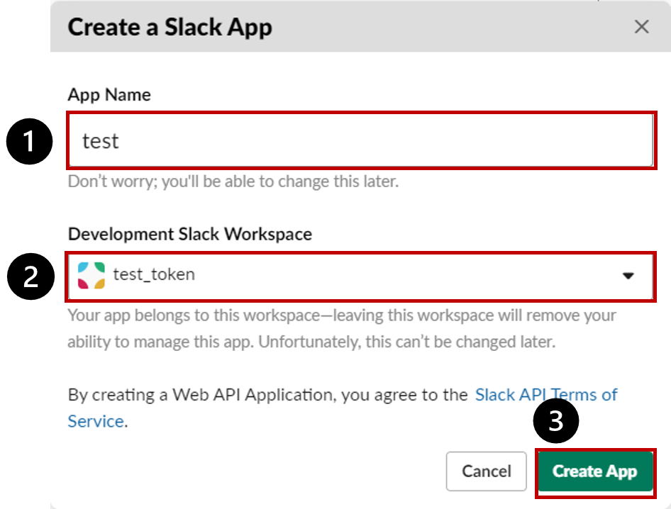</kbd>  

### APP 생성 완료화면
APP을 생성하면 다음과 같은 화면이 노출됩니다.  
<kbd>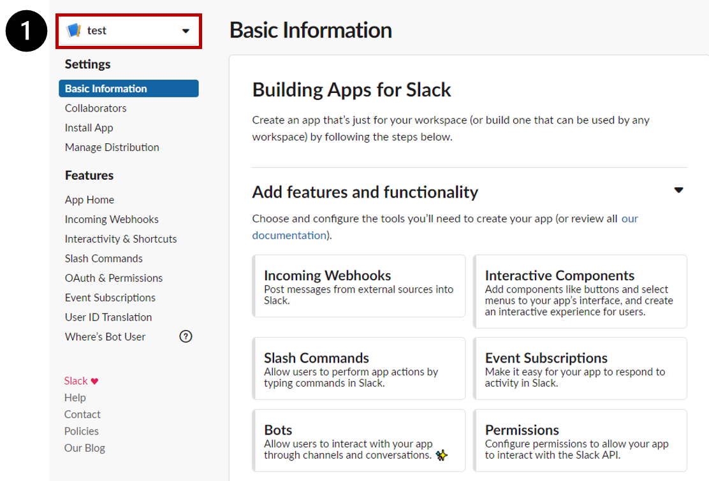</kbd>  

### Incoming Webhooks 활성화하기
`[경로] https://api.slack.com/apps > 앱선택 > Settings > Features > Incoming Webhooks`  
Incoming Webhooks를 활성화합니다.  
<kbd>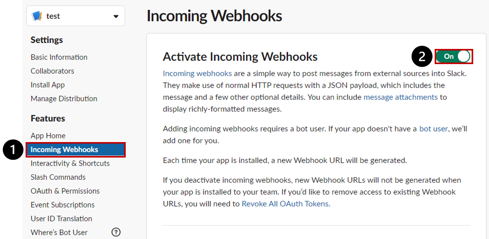</kbd>  

### Add New Webhoook to Workspace를 추가하기
`[경로] https://api.slack.com/apps > 앱선택 > Settings > Features > Incoming Webhooks`  
Add New Webhoook to Workspace를 추가합니다.  
<kbd></kbd>  
<kbd>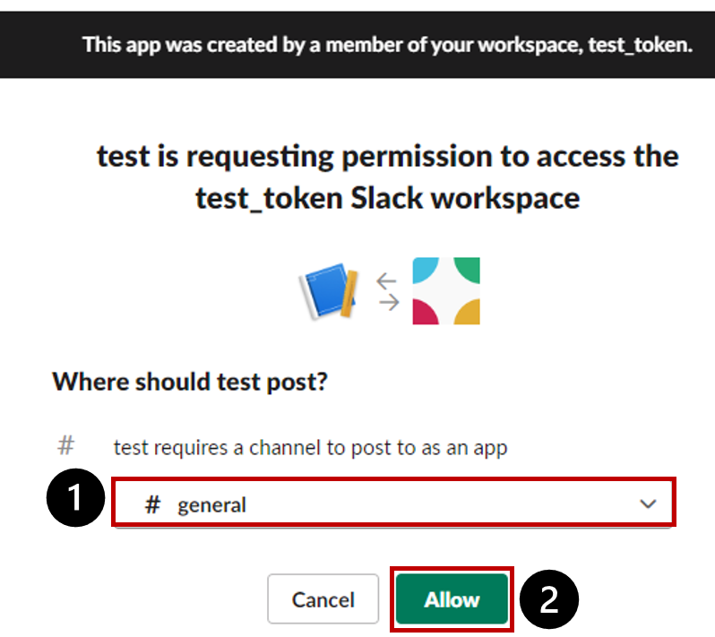</kbd>  

### Webhook URL 생성완료 및 복사하기
`[경로] https://api.slack.com/apps > 앱선택 > Settings > Features > Incoming Webhooks`  
<kbd>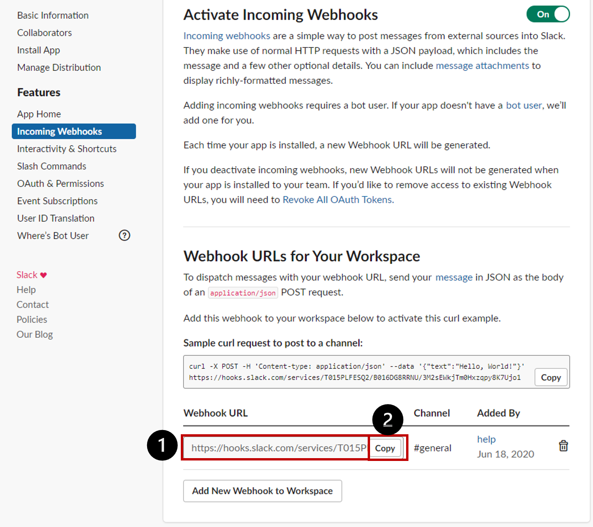</kbd>  

### Redirect URL 추가하기
`[경로] https://api.slack.com/apps > 앱선택 > Settings > Features > OAuth&Permissions > Redirect URLs`  
Redirect URLs에 복사한 Webhook URL을 붙여넣어줍니다.  
<kbd>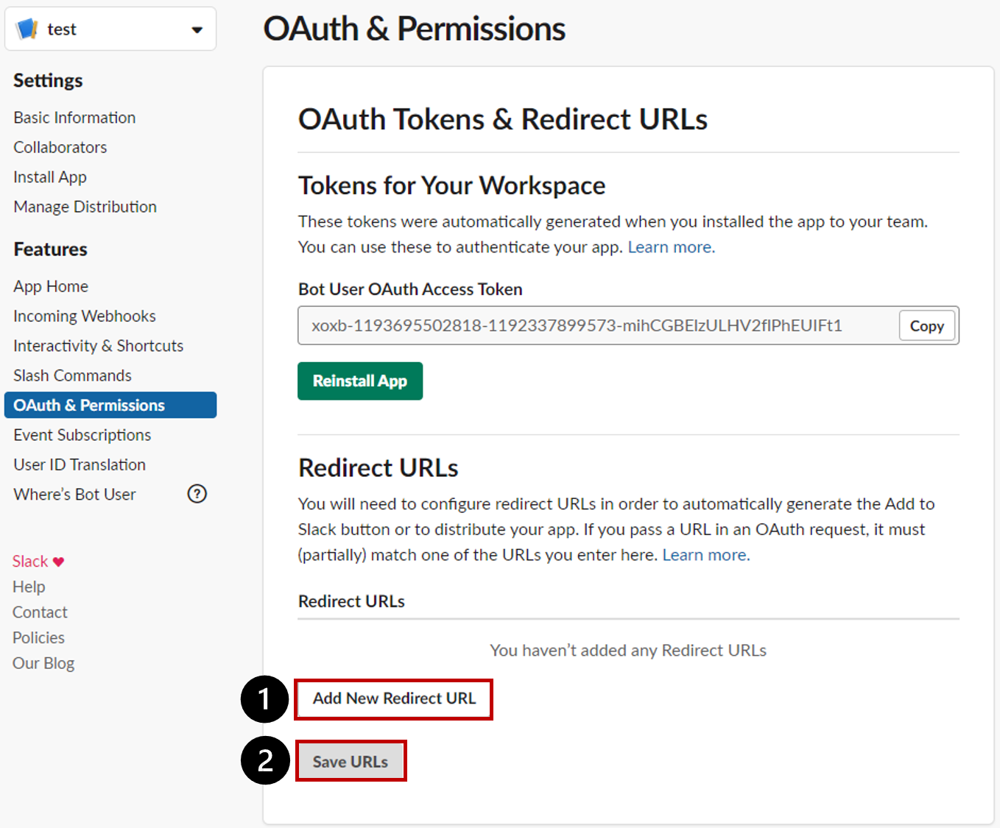</kbd>  

### Redirect URL 설정확인
Redirect URLs이 등록된 것을 확인합니다.  
<kbd>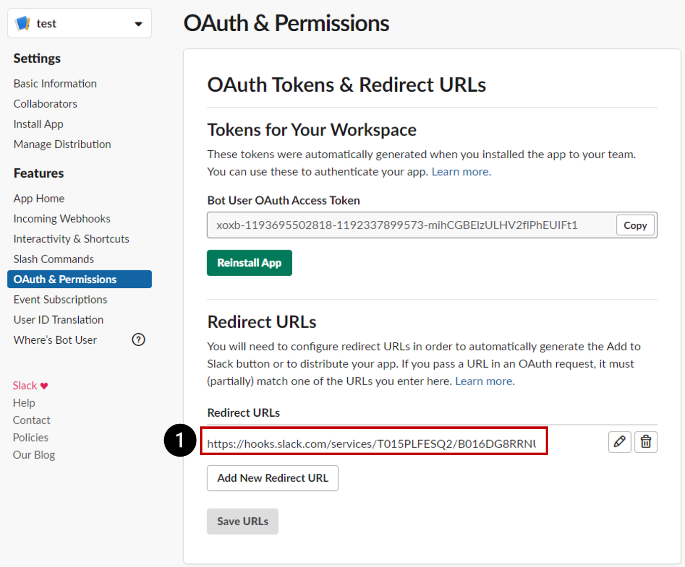</kbd>  

### Scopes 등록하기
`[경로] https://api.slack.com/apps > 앱선택 > Settings > Features > OAuth&Permissions > Scopes`  
OAuth Scope에 channels:read/chat:write/chat:write.public/incoming-webhook를 추가합니다.  
<kbd>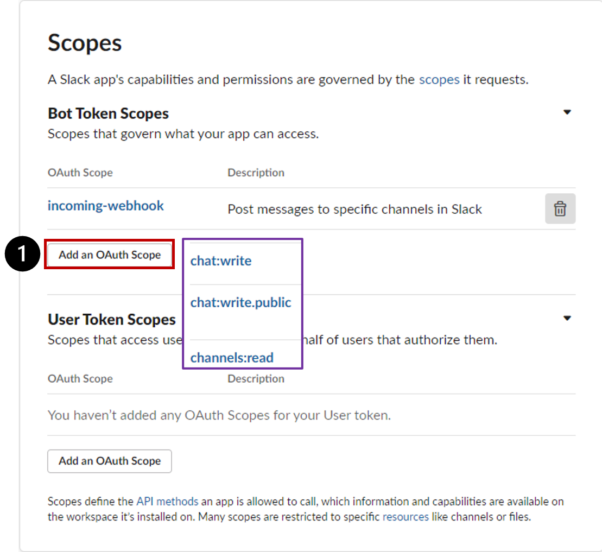</kbd>  
<kbd>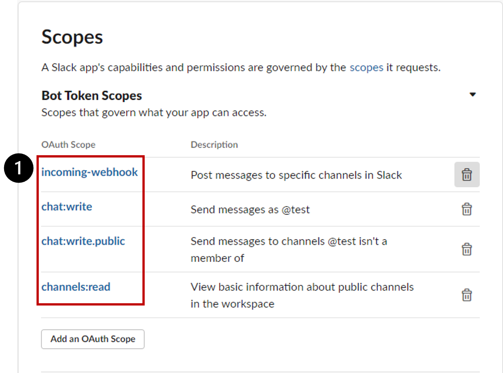</kbd>  

### User Token Scopes 등록하기
`[경로] https://api.slack.com/apps > 앱선택 > Settings > Features > OAuth&Permissions > Scopes > User Token Scopes`  
User Token Scopes에 chat:write를 추가합니다.  
<kbd>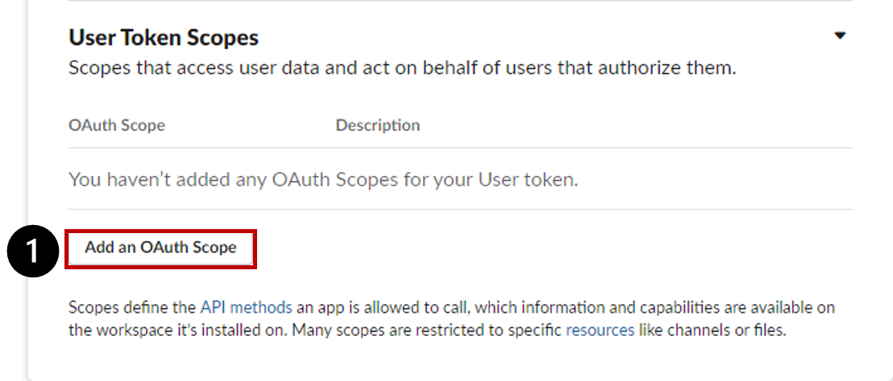</kbd>  
<kbd>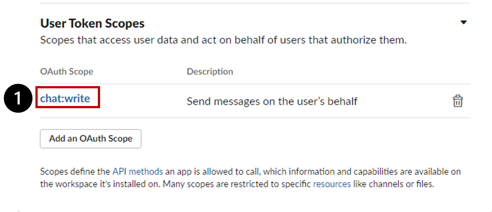</kbd>  

### APP 재설치하기
`[경로] https://api.slack.com/apps > 앱선택 > Settings > Features > OAuth&Permissions > OAuth Tokens & Redirect URLs`  
APP을 재설치합니다.  
<kbd></kbd>  
<kbd>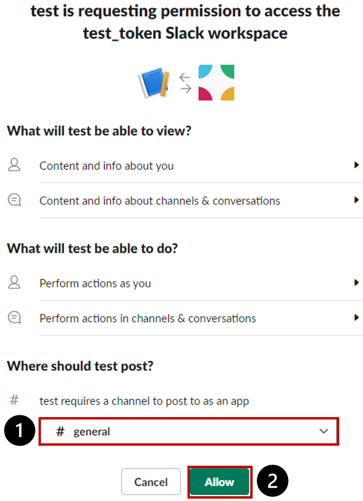</kbd>  

### OAuth Tokens 발급 확인
`[경로] https://api.slack.com/apps > 앱선택 > Settings > Features > OAuth&Permissions > OAuth Tokens & Redirect URLs`  
OAuth Tokens발급이 완료되었습니다. 이제 주소를 복사해서 페이플 관리자에 등록하세요.  
<kbd>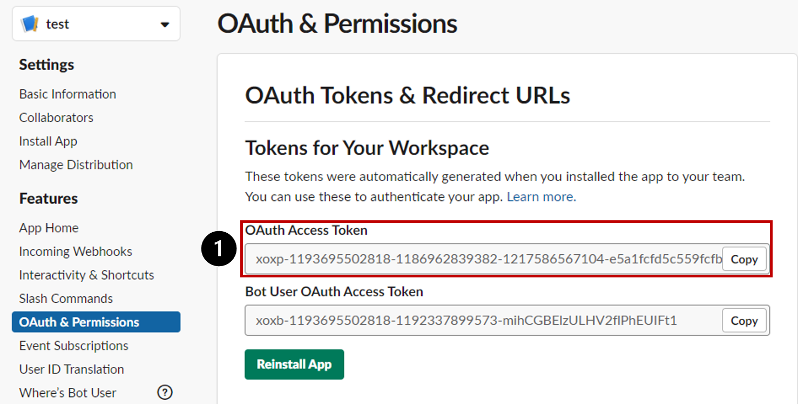</kbd>  

## 문의  
* 기술문의 : dev@payple.kr 을 통해 보다 자세한 문의가 가능합니다.
* 가입문의 : 페이플 웹사이트 [가입문의하기](https://www.payple.kr) 또는 help@payple.kr 로 문의주시면 빠르게 안내 받으실 수 있습니다. 
